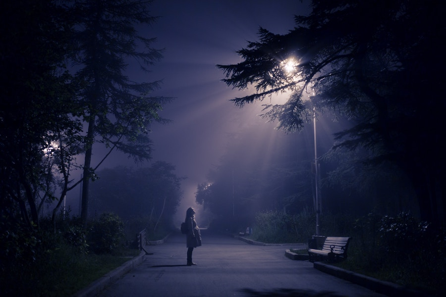

## Welcome Aboard

After some high-profile reports in 1970s, the phenomenon of [alien abduction](https://en.wikipedia.org/wiki/Alien_abduction)
started to gain acceptance in the popular culture.

### Beam Me Up

Being carried away into or via or by a beam of bright light is a particularly common description of how an alien
abduction experience begins. What happens later may be painful or pleasant and while some abductees become scarred
for life, others can not wait for the next experience.

#### Contactees

The lucky *abductees* who particularly enjoy their interactions with aliens are known as *contactees*,
to account for the voluntary character of their repeated experiences.

##### Image Credit

<small>[Alien abduction](https://unsplash.com/photos/jGN7JUKZcU0) photo by [Artem Kovalev](https://unsplash.com/@artemkovalev).</small>
