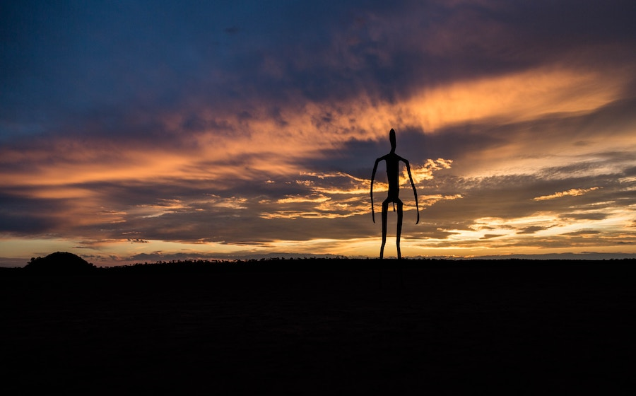

## Humanoid Aliens

Alongside the introduction of the [UFO terminology](../saucer-to-ufo/) in the 1950s, reports of
sighting the bodies of the alien occupants of the UFOs--dead or alive--started to accumulate.

Typically, the reports described figures to be generally of a humanoid body plan, but with
distinctively alien features, such as large heads and slender limbs.

##### Image Credit

<small>[Alien figure](https://unsplash.com/photos/vPoKUPztOZM) photo by [Brian McMahon](https://unsplash.com/@mcmre).</small>
