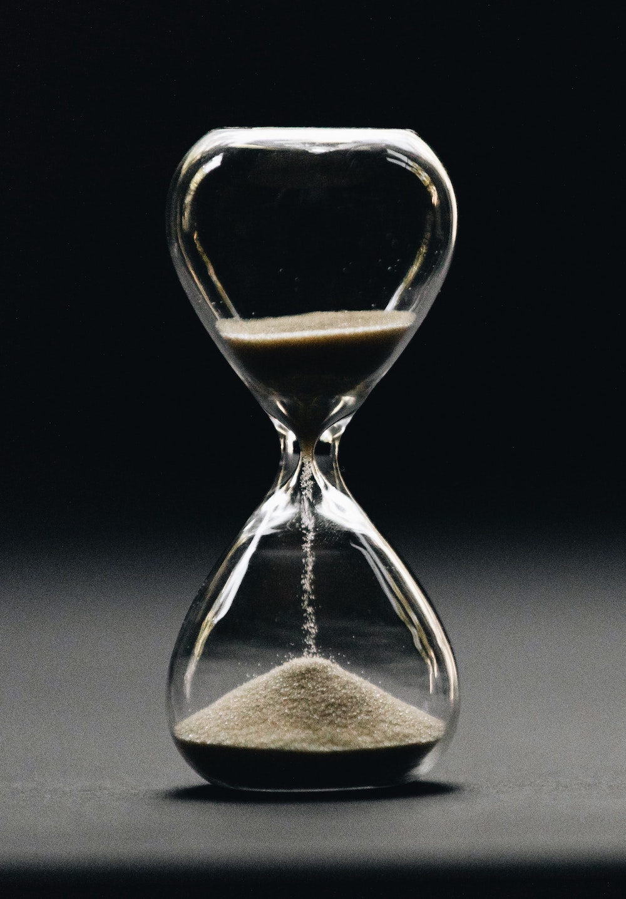

## Evolution of the Concept of Time

*BBC Future* presented an overview of the [history of time keeping](https://www.bbc.com/future/article/20220721-the-super-clocks-that-define-what-time-it-is), from the local, and somewhat "natural", time kept in pre-industrial society to the ever increasing need for more accurate standard time in the industrial age.

##### Image Credit

<small>[Hourglass](https://unsplash.com/photos/5Hl5reICevY) photo by [Nathan Dumlao](https://unsplash.com/@nate_dumlao).</small>
