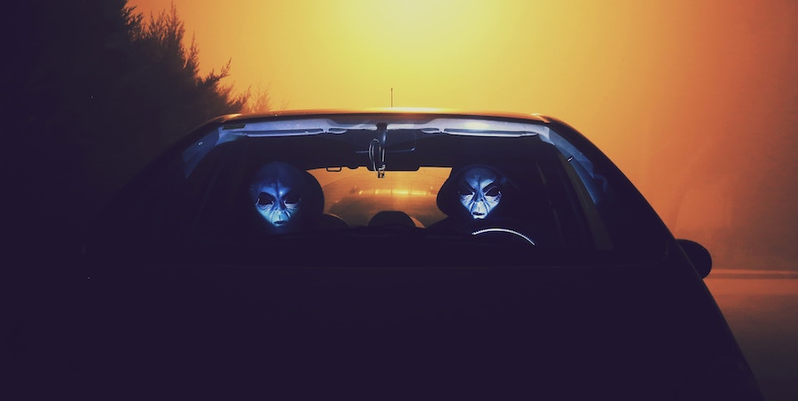

## They Are Here Already

Thanks, in part, to the popular 1990s [TV show](https://en.wikipedia.org/wiki/The_X-Files)
and [movies](https://en.wikipedia.org/wiki/Men_in_Black_(film_series)), the idea that aliens
are already present on Earth has gained cultural, if not scientific, acceptance.

### Alien Spotting

Due to their putatively distint [appearance](../alien-sightings/), one would assume that
spotting aliens, whether among the crowd of humans or when engaged in everyday activities, should be easy.

Of course, helped by their extraterrestrial technology, aliens tend to evade being noticed. And if
they are noticed, intentionally or accidentally, attempts to capture them in photos, or even in memory, usually fail.

## Exopolitics

Some [contactees](../alien-abductions/), of course, report to be allowed by the aliens
to retain some memory (although usually not material evidence) of their repeated contacts. Typically,
the motivation is described as the desire of the aliens to establish grass-roots
[exopolitical](http://rationalwiki.org/wiki/Exopolitics) activities, effectively creating their
own version(s) of the [Ambassador to the Universe](../calling-aliens/) program.

##### Image Credit

<small>[Aliens in a car](https://unsplash.com/photos/iUS8HYDhCsQ) photo by [Miriam Espacio](https://unsplash.com/@miriamespacio).</small>
