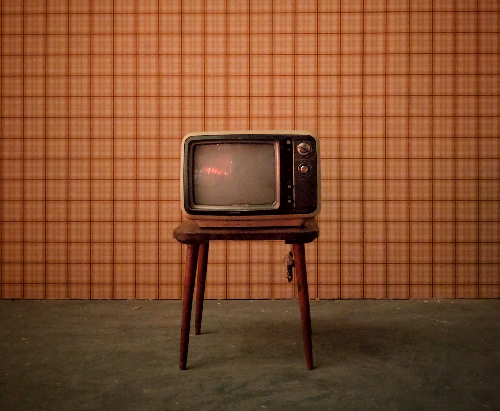

## UFOs as a Cultural Phenomenon

*BBC Culture* presented an overview the early [history of UFOs](https://www.bbc.com/culture/article/20220714-the-ufo-sightings-that-swept-the-us) in the US as a cultural phenomenon, focusing on early media coverage and movies.

### Evolution of Terminology

As part of the narrative, the article traces the evolving terminology from [flying saucer](../flying-saucer/) to [UFO](../saucer-to-ufo/) to [UAP](../ufo-to-uap/). Presented in a 'matter of fact' voice by a major mainstream media company, this reflects the incorporation of the once-esoteric jargon into popular culture.

##### Image Credit

<small>[Retro TV](https://unsplash.com/photos/UBhpOIHnazM) photo by [Ajeet Mestry](https://unsplash.com/es/@ajeetmestry).</small>
