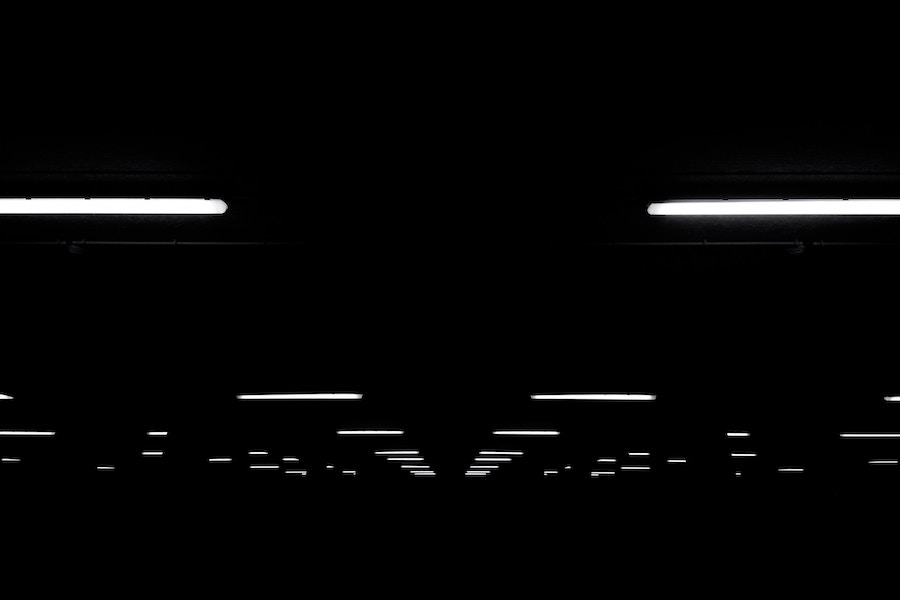

## Darkness and Lights

Black triangles became a common type of reported UFOs after a major wave of
[sightings](https://en.wikipedia.org/wiki/Belgian_UFO_wave) in Belgium in 1980s.

They appear as dark shapes, silently flying over major roads and cities, seen only by the bright
lights that suggest the triangular shape.

### Military or Alien?

The similarity of the shape to some modern military aircraft and the occasional appearance of
these UFOs close to military bases, secret installations, nuclear facilities, etc. creates
an enduring mystery about their alien or military origin.

##### Image Credit

<small>[Lights overhead](https://unsplash.com/photos/R_FPsOWp2r0) photo by [David Werbrouck](https://unsplash.com/@bigkids).</small>
