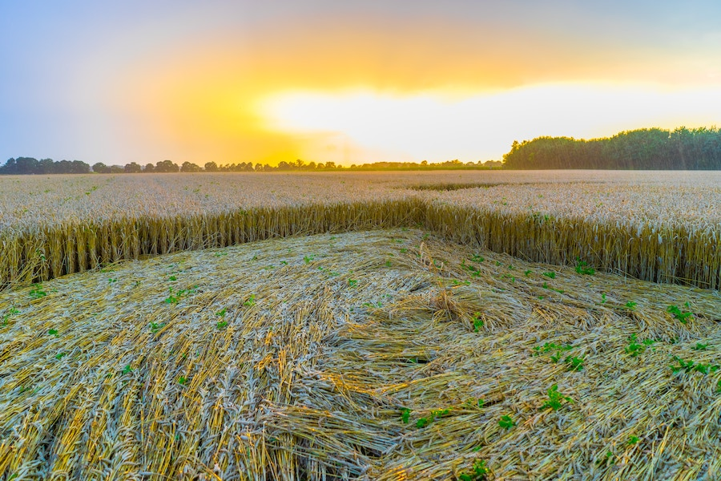

## Made by UFOs?

The phenomenon of the [crop circles](https://en.wikipedia.org/wiki/Crop_circle) became widely known in 1980s.
Many of the early crop circles were just that: circles created in fields by bending the plants down to the ground.

Coupled with nearby UFO sightings, the obvious hypothesis about the origin of crop circles connected them to the UFOs.
Disk-like [shapes](../disks-of-light/) associated with UFOs helped to "close the circle", as it were.

### Or Made for UFOs?

The much more complex shapes observed in the fields since the 1980s, however, produced an alternative hypothesis about
the origin of at least some of these objects. Perhaps, someone or something is creating the geometrical shapes that are
filled with mathematical and scientific implications to communicate with aliens?

##### Image Credit

<small>[Crop circle](https://unsplash.com/photos/1vbf7UsQEQ0) photo by [Sigmar Schnur](https://unsplash.com/@nanpudagio).</small>
