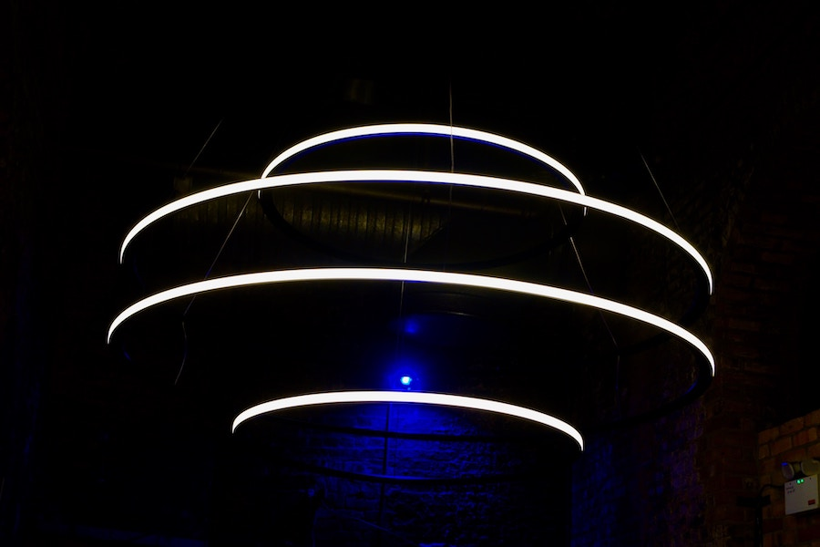
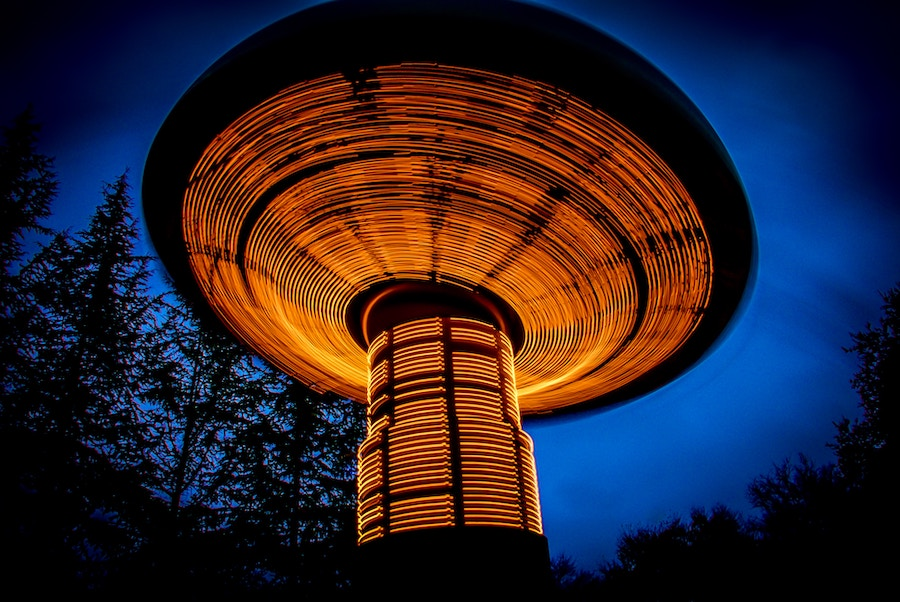

## Real-life Special Effects

Modern digital cameras can produce very interesting photos with long exposure in the dark.
In particular, this approach can produce sharp disks of light, as the trajectories of
spinning lights are traced in a dark room or against the night sky.

### Indoor Flying Disks

A whirlwind of moving bright lights in a dark room. 

### Taking Off in Gilroy Gardens, CA

Started as a children's spinning swing ride, but the children have already disappeared! 

##### Image Credits

- <small>[Disks of light](https://unsplash.com/photos/Tij5HRslPBY) photo by [James Orr](https://unsplash.com/@orrbarone).</small>
- <small>[Spinning swing ride](https://unsplash.com/photos/W3UADWjdnVc) photo by [David Brooke Martin](https://unsplash.com/@dbmartin00).</small>
