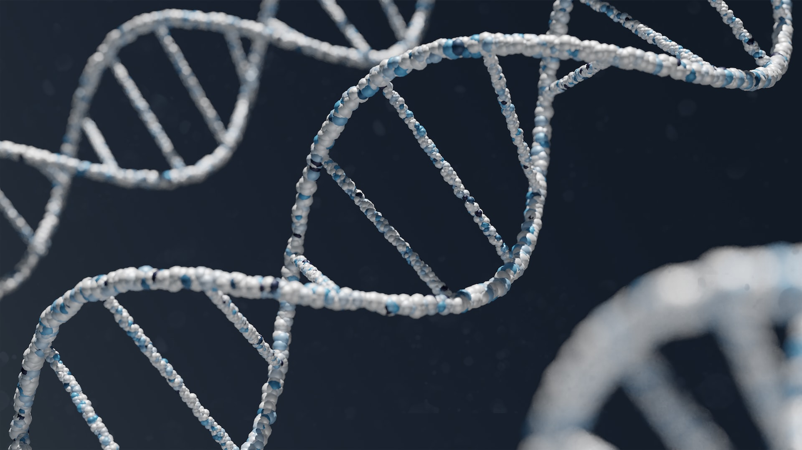

## Data Storage in DNA

While the concept of storing data in DNA has been discussed in science fiction for decades, researchers are currently working on practical schemes to [store data in DNA](https://www.bbc.com/future/article/20221007-how-to-store-data-for-1000-years). The advances in DNA biotechnology made this concept particularly attractive for long-term backup storage of data, as well-stored DNA is expected to be readable for 1000 years or more.

### Ancient Alien DNA?

Some people in the UFO community already believe that the DNA of humans carries information that had been encoded in it by one or more groups of ancient aliens. Alternatively, the DNA of modern humans and animals is believed by others to be the target of various [abduction](../alien-abductions/) experiences. In other words, the value of information stored in DNA has been long speculated to be significant for aliens: past, current, or future ones.

##### Image Credit

<small>[DNA molecules](https://unsplash.com/photos/-qycBqByWIY) by [Warren Umoh](https://unsplash.com/@warrenumoh).</small>
