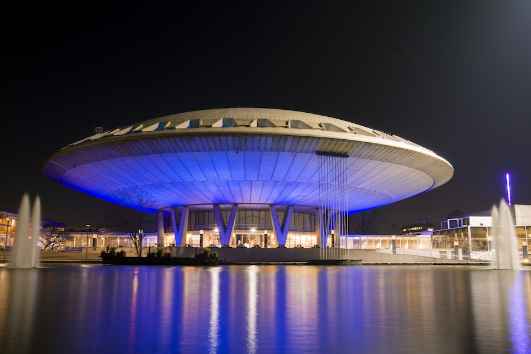

## Aspirational and Inspirational

Having become part of the [retro-futuristic](../retro-flying-saucers/) style, flying saucers firmly entered the
modern architecture.

### Malmö, Sweden

This one is looking skyward from Malmö, presumably thinking about returning home.

### Eindhoven, Netherlands

And this one has landed in Eindhoven and masquerades as the Evoluon building.

##### Image Credits

- <small>[Photo](https://unsplash.com/photos/aBUeqDBD34c) by [Pierre Châtel-Innocenti](https://unsplash.com/@chatelp) from [Unsplash](https://unsplash.com/).</small>
- <small>[Photo](https://unsplash.com/photos/sN8LGWF7A0I) by [Daniel](https://unsplash.com/@hardwaredani) from [Unsplash](https://unsplash.com/).</small>
