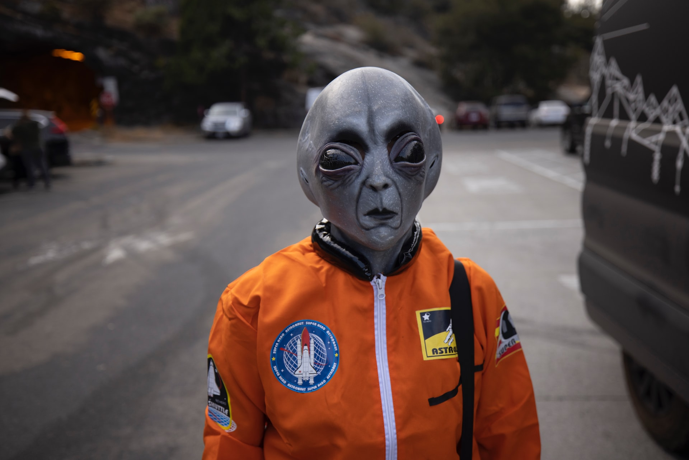

## NASA Panel Will Analyze the Evidence for UAPs

As reported on [space.com](https://www.space.com/nasa-ufo-study-progress-uap) and [The Register](https://www.theregister.com/2022/08/19/nasa_ufo_investigation/), NASA will form a panel of experts to analyze and process evidence of UAPs. The panel will work for nine months and then reveal the results to the public.

### UAP Terminology in Action?

The unidentified aerial phenomena (**UAP**) term was created as a more serious [substitute](../ufo-to-uap) for the previous **UFO** term. An official NASA panel dedicated to UAPs might be considered as an indication of a success of that strategy. Especially an investigation described by NASA as 'going full force'.

##### Image Credit

<small>[NASA Alien](https://unsplash.com/photos/ljNJn0ommQ8) photo by [Stephen Leonardi](https://unsplash.com/@stephenleo1982).</small>
