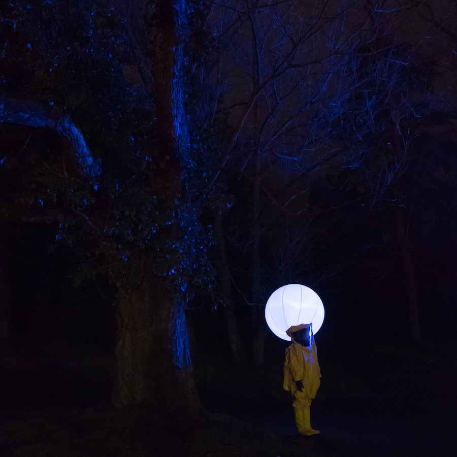
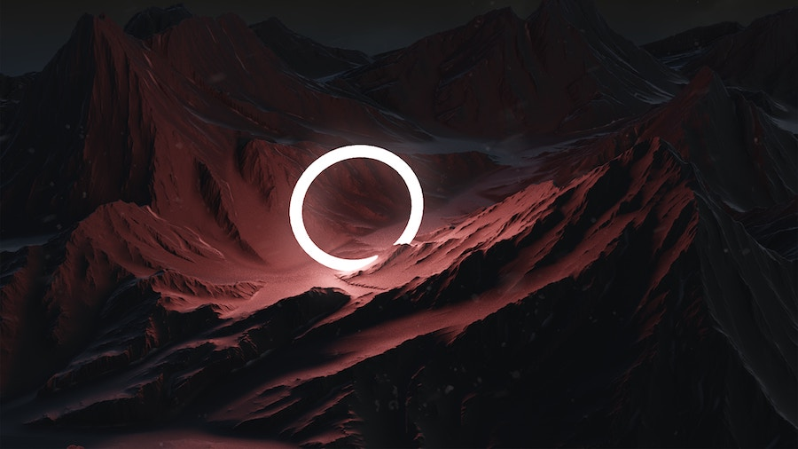

## Luminous Orbs

The theme of simple [shapes](../crop-circles/) and [lights](../black-triangles/) connected to UFOs continues with
common reports of sighting at a close distance of orbs that are illuminated from within.

The orbs are often described as impossibly bright white or fiery, but other colors have been reported as well.

### Shapes of Light

In addition to orbs, other geometric shapes are also reported as luminous UFOs.

Observations of UFO shapes that look like closed or looped paths of light suggest various
hypotheses related to alien technology that can bend light in free space or even the space-time itself.

##### Image Credits

- <small>[Light orb](https://unsplash.com/photos/g1aogZjtKjs) photo by [Olivier Miche](https://unsplash.com/@oliviermiche).</small>
- <small>[Disk of light](https://unsplash.com/photos/0qPE7ESG7_8) photo by [Thomas Claeys](https://unsplash.com/@thomascl).</small>
