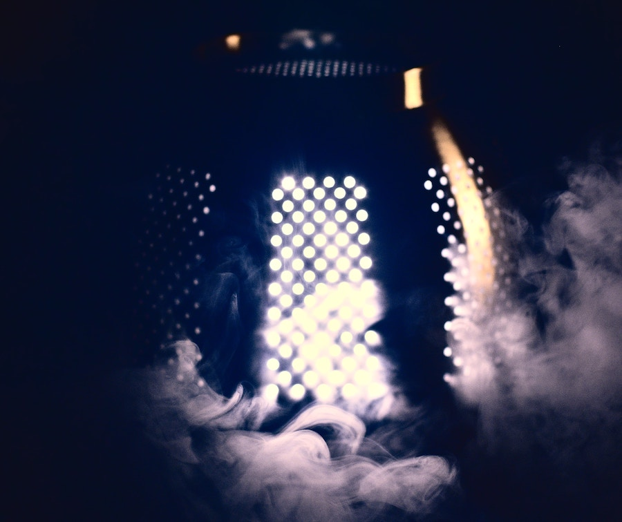
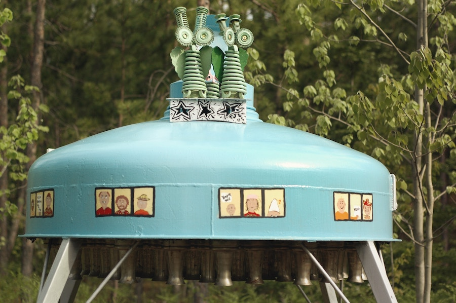

## Futuristic for Their Time

Ideas about what the *flying saucers* might look like up-close matched the
general sense in the 1950s of what future or sci-fi technology may look like.

### Scary in the Dark

When approached in the dark, the alien technology would look appropriately
scary. If not downright sinister, then at least unsettling.

### Whimsical by Day

But in the light of the day, the details of the alien technology would seem positively
quiant, apparently using the same standard components as high-voltage
transformers on Earth.

## Not Mid-Century Modern

Interestingly, the "futuristic" style of alien objects did not match the vision of the future that inspired the
clean lines of the [mid-century modern](https://en.wikipedia.org/wiki/Mid-century_modern) style,
which was popular at the time for domestic objects and in the architecture.

##### Image Credits

- <small>[Lights and smoke](https://unsplash.com/photos/IQWESbqLp5I) photo by [Filip Bunkens](https://unsplash.com/@thebeardbe).</small>
- <small>[Green saucer](https://unsplash.com/photos/66PS1zcmfps) photo by [Jen Theodore](https://unsplash.com/@jentheodore).</small>
